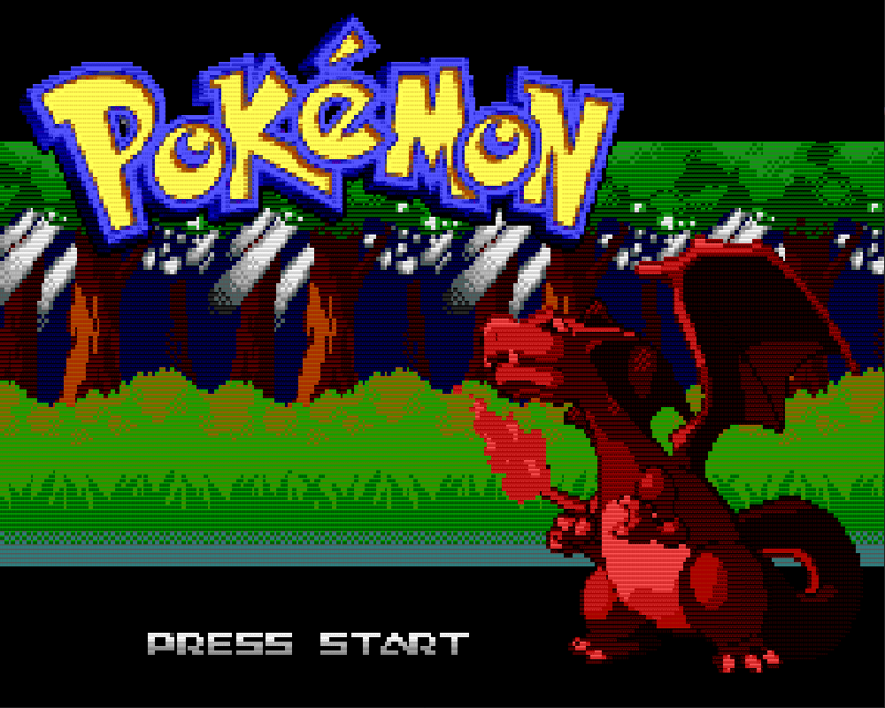
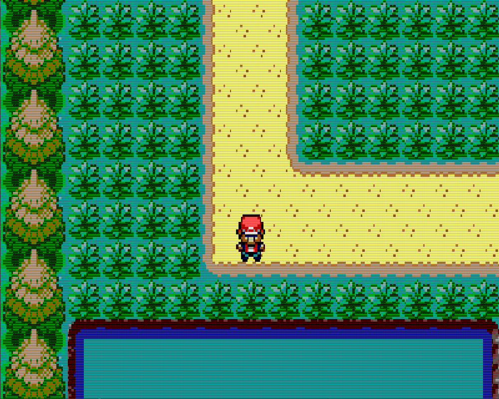
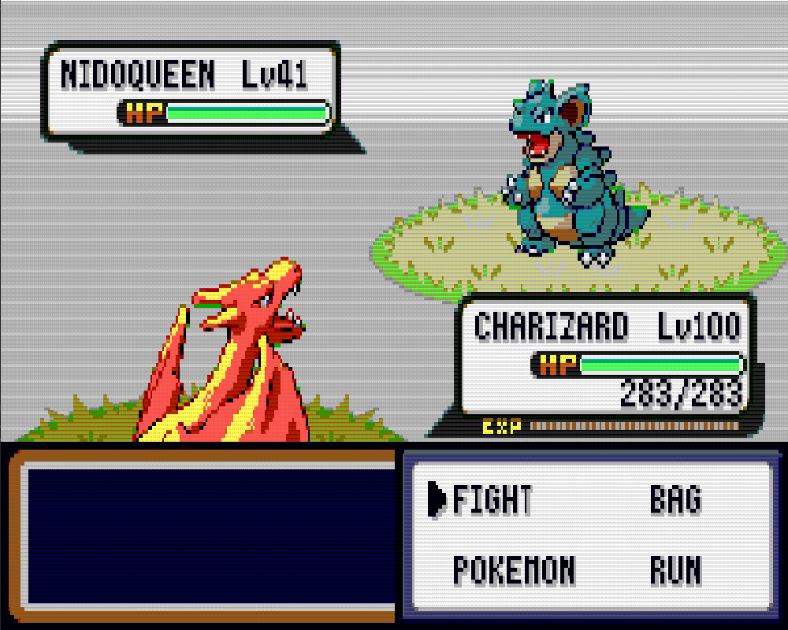
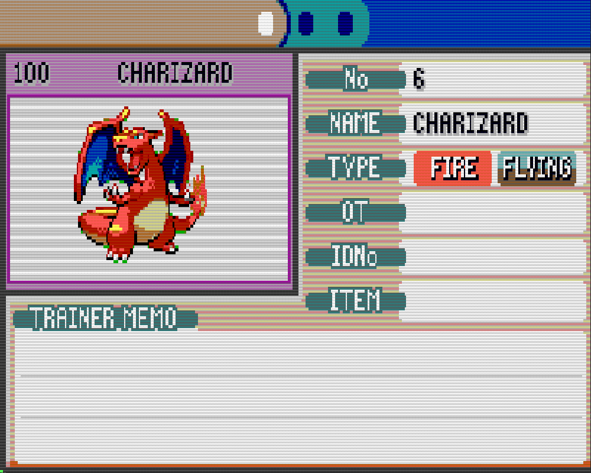

# Pokémon: A Sequel Coming In Inevitably 

A *mock* version of the ***Pokémon*** series, more specific, the *Fire Red*/*Leaf Green* games from *Gameboy Advance*.  

## Controls 🎮

- **Arrows** - Control the character and menus
- **Enter** - Selection
- **S** - Open up *pokémon* information menu

## Developed by 👥

- **Ana Inês Barros** - [@anaines14](https://github.com/anaines14)
- **Eduardo Correia** - [@Educorreia932](https://github.com/Educorreia932)