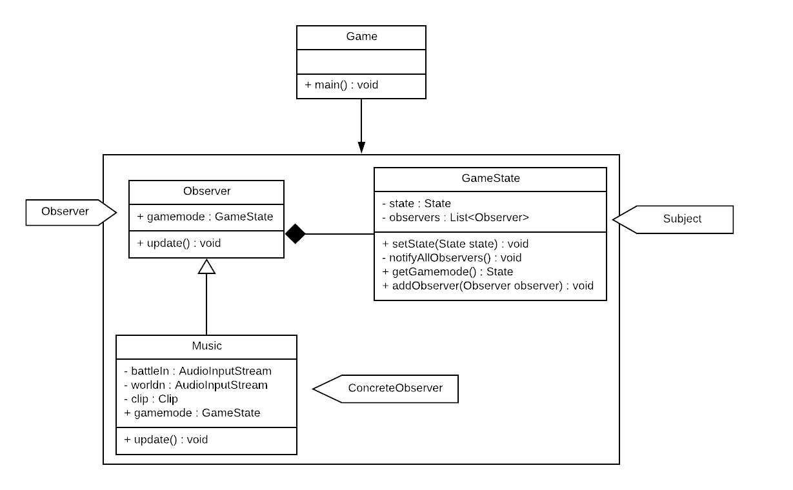

# LPOO_40 - Pokémon: A Sequel Coming In Inevitably

Our game consists, as the title states, in a *mock* version of the RPG Pokémon series, more specific, the Fire Red/Leaf Green games from Gameboy Advance.  

In it, the player will be able to catch and battle with pokémons in tall grass, try to catch them or even battle them with other their own pokémon.

The protagonist is a young boy who goes on a journey to be the very best pokémon trainer like no one ever was. 🎵

 In order to achieve his goal, the player will have to catch pokémon and battle other trainers. Whenever he wins a battle its pokémon gain experience points and when they gather a certain amount of experience, they level up or even evolve.  

This project was developed by [*Ana Inês Barros*](https://github.com/anaines14) (up201806593@fe.up.pt) and [*Eduardo Correia*](https://github.com/educorreia932) (up201806433@fe.up.pt) for LPOO 2019/2020.

## Table of Contents

* [Table of Contents](#table-of-contents)
* [Implemented Features](#implemented-features)
    + [Player](#player)
    + [Pokémon](#pok-mon)
    + [Battle](#battle)
* [Planned features](#planned-features)
    + [Player](#player-1)
    + [Pokémon](#pok-mon-1)
    + [Battle](#battle-1)
    + [Other](#other)
* [Architectural Pattern](#architectural-pattern)
  - [World](#world)
  - [Battle](#battle-2)
  - [Options Menu](#options-menu)
    * [Design](#design)
    + [Music](#music)
+ [Gamemode](#gamemode)
  - [Problem in Context](#problem-in-context)
  - [The Pattern](#the-pattern)
  - [Implementation](#implementation)
  - [Consequences](#consequences)
+ [Input](#input)
  - [Problem in Context](#problem-in-context-1)
  - [The Pattern](#the-pattern-1)
+ [Graphics](#graphics)
  - [The Pattern](#the-pattern-2)
  - [Implementation](#implementation-1)
  - [Consequences](#consequences-1)
* [Code Smells and Possible Refactorings](#code-smells-and-possible-refactorings)
  - [Dispensables - Data Class](#dispensables---data-class)
  - [Dispensables - Lazy Class](#dispensables---lazy-class)
  - [Bloaters - Switch Statements](#bloaters---switch-statements)
* [Testing](#testing)
* [Self-Evaluation](#self-evaluation)
* [Game Resources](#game-resources)
    + [Images](#images)
    + [Data Files](#data-files)

## Implemented Features

### Player

- **Character Movement** - The player will move with the arrow keys in the desired direction, as well its sprite will change according to the direction he's facing.

  

- **Pokémon Appearing in Tall Grass** - When the player walks trough grass, they may encounter a wild pokémon and if so a battle with it will start. 

    

### Pokémon

- **Pokémon Types** - These are properties of pokémon and their moves. A pokémon may have up to two types, while a move only has one.

  

**Note:** Fairy type isn't included in our game,  as it wasn't in the original 3rd generation pokémon games.

- **Type Effectiveness** - When a pokémon uses a move, the damage it will cause to the adversary pokémon will depend on the move's type and the other pokémon's type(s).   
A super effective attack will cause 2x the damage, a not very effective will cause 0.5x the damage and a no effect will cause 0x damage.  
For instance, the Water type is super effective against Fire, so if a Water pokémon move is used against a Fire pokémon, it would cause two times the normal damage it would cause.

### Battle

- **HP and Experience Bar** - These bars represent, respectively, the total health percentage of a pokémon in-battle and its experience progress from its current level to the next.

  
  

- **Battle Options Menu** - While in-battle the player has four options of what to do.  
    

        
    

    - **Fight** - Make the pokémon use one its moves.
    
    

        
    

        
    - **Bag** - Use an item from the bag.
    - **Pokémon** - Change that's pokémon currently fighting for another one on the party.
    - **Run** - Try to flee from the battle.

## Planned features

### Player

- **Movement Animation** - When the player moves in a direction, a walking animation will play.
- **Ability to Run** - When the player presses the Z key while moving, they will start to run.
- **Option to be a Boy or a Girl** - At the start of a new game, the player may chose his character gender (for cosmetic purposes only).

### Pokémon

- **Leveling Up** - A pokémon's level goes from 1 to 100 and it can level up when it reaches a certain amount of experience, improving its stats.
- **Evolving** - Some pokémon have two or even three different evolutions and if so, they evolve when they reach a certain level.

### Battle

- **Use Moves** - Make it possible to choose one of the four pokémon moves and use it against the opponent.
- **Pokémon Moves Animations** - Implement animations for each move.
- **Use items** - Make it possible to access the bag and use an item, such as Potions or Pokéballs.

### Other

- **Save the progress**
- **Create profiles**
- **Create NPCs** - Have NPCs in the overworld whom which the player might interact.

## Architectural Pattern

For easier development of the game, we implemented the MVC (Model–View–Controller) design pattern, with the following division.
- **Model (data)** - Stores all of the lpoo.pokemonascii.data structure of the game and its current state.
- **View (gui)** - Handles the interaction with the user, be it input, by pressing the keyboard's keys, or be it output, by a graphical interface that represents the game.
- **Controller (rules)** - Coordinates and processes all the changes that occur.

  

Our game currently has the MVC implemented in the following modules:

#### World 

Player walks around the world

#### Battle

Two pokémon battle each other

#### Options Menu

For menus where the user has choose some option

## Design

### Music

#### Problem in Context
We wanted to add some music to our game so it would even be more similar to the original game. 
We downloaded the correspondent theme songs for both the [world](../data/Music/town.wav) mode and the [battle](../data/Music/battle.wav) mode. However, 
we still had to think about the best way to implement this. 

The problem was that we could not assign 
the task to any class. We could not assign the "dj" responsability to the battle or the world as we first thought 
since this would add to the responsabilities of those classes. 
We had to make sure we were not going against any *SOLID* principle. 

#### The Pattern

We have applied the **Observer Pattern**. This pattern allows us to make sure a list of observers of
 some class is notified every time its state changes. This was exactly what we wanted. Although the gamemode
  will have only one observer, by doing this we guarantee that the class responsible by the music change will be 
  notified every time the gamemode's state is altered. 
  
  In other words, when the game changes states, it notifies its observers. Since the [class Music](../src/main/java/lpoo/pokemonascii/rules/observer/Music.java) will 
  be an observer of [GameState](../src/main/java/lpoo/pokemonascii/rules/state/GameState.java), its update() method is called. As a consequence, the track playing 
  is set accordingly to the state the game is currently in.

#### The Implementation

  

#### Consequences

- We can establish relations between objects at runtime
- Open/Closed Principle. We can add more observers without changing the GameState code.
- Single Responsabilty Principle. We avoided adding more responsabilities to other classes.

### Gamemode

#### Problem in Context

Our game will often alternate between roaming the overworld and battling with pokémon. When the player finds a pokémon in grass of battles against a NPC they will be prompted to a battle mode and when the battle is over, they return to where they were in the overworld.

In other words, the game will have different gamemodes at each time depending on the actions of the player and this can quickly expand if we think of a main menu or like so. For that purpose, we neeeded a way to manage which was the currently state of the game and switch to it.

  

#### The Pattern

State

#### Implementation

  

#### Consequences

- We don't have to rely on flags.
- No more complex if.
- More classes.

### Input 

#### Problem in Context

Depending on the currently game state, different keyboard inputs might execute different actions and sometimes we may even want to undo an action that we commited (like going back on a menu for example).  

#### The Pattern

For that purpose, we used the [Command](../src/main/java/lpoo/pokemonascii/rules/commands.java) design pattern.

### Graphics

#### Problem in Context

Due to the fact that pokémon games from Gameboy Advance graphics are colorful and complex, we had to adapt them to meet Lanterna's limitations. 

The way we did this was to initially convert a `.png` image to text, using `img2txt`, a program from [libcaca](http://caca.zoy.org/wiki/libcaca). That program generates a `.svg` that we parse and then draw using Lanterna.

We store the parsed image content (such as colors and text characters) in a class `Image` and then we have a class [Sprite](../src/main/java/lpoo/pokemonascii/gui/Sprite.java) that can store multiple `Images`, each one corresponding to a certain state of what the `Sprite` represents, for instance, the `Player` `Sprite` will have an image for each facing direction.  

For each game element we have a [Renderer](../src/main/java/lpoo/pokemonascii/gui/renderers) that is responsible for drawing it in the screen. 

However, some elements of the game have a common general way to draw, but slightly differences between, such as [bars](https://github.com/FEUP-LPOO/lpoo-2020-g40/tree/master/src/main/java/lpoo/pokemonascii/gui/renderers/bar). In battle, we have two distinct types of bars, the [health bar](https://github.com/FEUP-LPOO/lpoo-2020-g40/blob/master/src/main/java/lpoo/pokemonascii/gui/renderers/bar/HealthBarRenderer.java) and the [experience bar](https://github.com/FEUP-LPOO/lpoo-2020-g40/tree/master/src/main/java/lpoo/pokemonascii/gui/renderers/bar/ExperienceBarRenderer.java). 

The way to draw them is the same, we have a percentage and the bar length corresponds to it. Yet, they have different behaviors, the health changes colors according to the health of the pokémon.

#### The Pattern

That being said, we used the **Template Method** pattern to solve this problem. This pattern allowed us to design a general skeleton for the way a bar is rendered, but allowing to slightly adjustments on that process.

#### Implementation

  

**Note:** We greyed out some parts of the diagram and removed some attributes and methods of those parts, because they weren't the focus of this pattern, but were relevant nonetheless.

#### Consequences

- Easier to add new renderers without repeating much code.
- Abstract the overall and focus on the differences.

## Code Smells and Possible Refactorings

#### Dispensables - Data Class

The class [Option](../src/main/java/lpoo/pokemonascii/data/options/Option.java) is an example of a Data class in our code.
 This class only has a string field and both a getter and a setter for accessing it. Removing this class would make the 
 code a little simpler since this class can be replaced by the primitive `String`.
 
#### Dispensables - Lazy Class

The class [Tile](../src/main/java/lpoo/pokemonascii/data/Tile.java) was designed in order to support future 
development work that has not been done yet. Our plan is to be able to create different tiles with distinct purposes 
and methods. However, at the moment, we only have one type of tile, the [Grass](../src/main/java/lpoo/pokemonascii/data/Grass.java) class.
  
Having this class provokes a small increment in the complexity and size of the code. To solve this problem, we could 
use the refactoring method **Collapse Hierarchy** by merging the Tile class with the [CollidingElement](../src/main/java/lpoo/pokemonascii/data/elements/CollidingElement.java) class.

#### Bloaters - Switch Statements

The method getNextCommand() in the [class BattleView](../src/main/java/lpoo/pokemonascii/gui/BattleView.java) has a long
 switch case inside of it. This creates a problem: Every time we want to have a condition we have to find all the switch 
 code and modify it. 
 
Since this *switch* is based on type code, we should use the **Replace Type Code with Subclasses** refactor method. To do this, instead of
using a enum to represent the key type, we should create a subclass **KeyType** and subclasses of KeyType to each value 
of the coded type. Then, extract the relevant behaviours from the original class to these subclasses. Replace the control
 flow code with polymorphism. By doing this we improve code organization.

Also, in the class [Game](../src/main/java/lpoo/pokemonascii/Game.java), 
in the class [BattleController](../src/main/java/lpoo/pokemonascii/rules/BattleController.java) and in the
the class [WorldController](../src/main/java/lpoo/pokemonascii/rules/WorldController.java) we have the use of null in a
if statement where we could appply the refactor method **Introduce Null Object** by creating a subclass that will perform
 the role of a null object, create a method isNull() and replace the code in the correct places.

## Testing

## Self-Evaluation

- Ana Inês Barros: 50%
- Eduardo Correia: 50%

## Game Resources

### Images

- [Pokémon - Battle](https://veekun.com/dex/downloads), veekun
- [HP Bars & In-Battle Menu](https://www.spriters-resource.com/game_boy_advance/pokemonfireredleafgreen/sheet/33690/), redblueyellow
- [Battle Backgrounds](https://www.spriters-resource.com/game_boy_advance/pokemonfireredleafgreen/sheet/3866/), Desgardes

### Data Files

- [Pokémon](https://github.com/r4vi/zipper-demo/blob/master/resources/pokemon.xml), r4v1
- [Pokémon Moves](https://github.com/veekun/pokedex/blob/master/pokedex/lpoo.pokemonascii.data/csv/moves.csv), veekun
